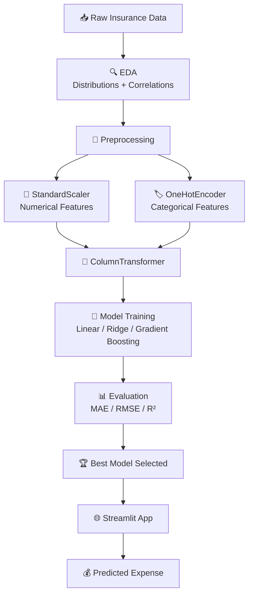

<div align="center">

# 🏥 Medical Insurance Cost Prediction
### *Using Machine Learning to put a number on "what could this cost you?"*

An end-to-end Machine Learning regression application that predicts **medical insurance expenses** based on demographic and lifestyle information — because knowing your risk profile shouldn't require an actuary.

<br>


<br>

[**📁 GitHub Repository**](https://github.com/SHALINISAURAV/medical-insurance-regression)

</div>

<br>

---

## 📚 Table of Contents

- [Project Overview](#-project-overview)
- [Why This Matters](#-why-this-matters)
- [Problem Statement](#-problem-statement)
- [Dataset](#-dataset)
- [Exploratory Data Analysis](#-exploratory-data-analysis)
- [Data Preprocessing](#️-data-preprocessing)
- [Models Trained](#-models-trained)
- [Evaluation Metrics](#-evaluation-metrics)
- [System Pipeline](#️-system-pipeline)
- [Streamlit Application](#-streamlit-application)
- [Project Structure](#-project-structure)
- [Tech Stack](#️-tech-stack)
- [Run Locally](#️-run-locally)
- [Future Improvements](#-future-improvements)
- [Author](#-author)

---

## 📌 Project Overview

This project is an end-to-end Machine Learning regression application that predicts **medical insurance expenses** based on demographic and lifestyle information.

Medical costs aren't random — they're shaped by measurable, everyday factors like age, weight, and smoking status. This project makes those hidden relationships visible, turning a handful of personal details into a data-driven expense estimate.

The project demonstrates the complete ML workflow:

- 📥 Data Collection
- 🔍 Exploratory Data Analysis (EDA)
- 🧹 Data Preprocessing
- 🛠️ Feature Engineering
- 🤖 Model Training
- 📊 Model Evaluation
- 🏆 Model Selection
- 🌐 Streamlit Deployment

---

## 🌟 Why This Matters

Insurance pricing can feel like a black box to the people it affects most. By surfacing which factors actually drive cost — and by how much — this project gives individuals a clearer, more transparent picture of their own risk profile, while also giving insurers and analysts an interpretable model to reason about instead of a black box.

> *Smoking status alone can shift predicted expenses more than every other feature combined — and this project shows exactly why.*

---

## 🎯 Problem Statement

Predict an individual's **medical insurance expenses** using:

| Feature | Description |
|---|---|
| 🎂 **Age** | Age of the individual |
| 🧑 **Sex** | Male / Female |
| ⚖️ **BMI** | Body Mass Index |
| 👶 **Children** | Number of dependents |
| 🚬 **Smoking Status** | Smoker / Non-smoker |
| 🌍 **Region** | Geographic region |

This is a **Supervised Machine Learning Regression** problem — the target variable (expenses) is continuous, not categorical.

---

## 📊 Dataset

| Feature | Type |
|---|---|
| `age` | Numerical |
| `sex` | Categorical |
| `bmi` | Numerical |
| `children` | Numerical |
| `smoker` | Categorical |
| `region` | Categorical |
| `expenses` | 🎯 Target |

---

## 📈 Exploratory Data Analysis

Performed:

- 🔍 Dataset inspection
- ❓ Missing value analysis
- 🔁 Duplicate detection
- 📊 Statistical summary
- 📈 Numerical feature distributions
- 📊 Categorical feature distributions
- 🔥 Correlation heatmap
- 🔵 Scatter plots
- 📉 Boxplots
- 🔗 Pairplots
- 🚨 Outlier analysis

### 🔑 Key Insights

| Insight | Detail |
|---|---|
| ✅ **No missing values** | Dataset is clean and complete |
| 📈 **Right-skewed expenses** | Most people have moderate costs; a few have very high costs |
| 🚬 **Smoking dominates** | Smoking status has the strongest effect on expenses |
| 🎂 **Age correlation** | Age positively correlates with expenses |
| ⚖️ **BMI effect** | BMI moderately affects expenses |
| 🌍 **Minor factors** | Region and sex have comparatively smaller effects |

---

## ⚙️ Data Preprocessing

### 🔢 Numerical Features

- `age`
- `bmi`
- `children`

**Applied:** `StandardScaler` — normalizes numerical ranges so no single feature dominates due to scale alone.

### 🏷️ Categorical Features

- `sex`
- `smoker`
- `region`

**Applied:** `OneHotEncoder` — converts categories into machine-readable binary vectors.

Both pipelines were combined using a **`ColumnTransformer`**, ensuring a single, clean preprocessing pipeline from raw data to model-ready features.

---

## 🤖 Models Trained

| Model | Notes |
|---|---|
| Linear Regression | Simple, interpretable baseline |
| Ridge Regression | Regularized variant to reduce overfitting |
| **Gradient Boosting Regressor** | 🏆 **Best performing model** |

> The Gradient Boosting Regressor was selected as the final model due to its superior ability to capture non-linear relationships — particularly the sharp cost jump associated with smoking status.

---

## 📊 Evaluation Metrics

| Metric | Purpose |
|---|---|
| **MAE** (Mean Absolute Error) | Average magnitude of prediction error |
| **RMSE** (Root Mean Squared Error) | Penalizes larger errors more heavily |
| **R² Score** | Proportion of variance explained by the model |

---

## ⚙️ System Pipeline



---

## 🌐 Streamlit Application

Users provide:

- 🎂 Age
- 🧑 Sex
- ⚖️ BMI
- 👶 Children
- 🚬 Smoking Status
- 🌍 Region

**Output:**

- 💰 Predicted Medical Insurance Expense

Simple in, simple out — no jargon, just an instant, personalized estimate.

---

## 📁 Project Structure

```text
medical-insurance-regression/
├── artifacts/              # Saved models, encoders, and scalers
├── data/                   # Raw and processed datasets
├── notebook/                # EDA and experimentation notebooks
├── src/                    # Preprocessing, training, and prediction scripts
├── app.py                  # Streamlit application entry point
├── README.md
├── requirements.txt
└── .gitignore
```

---

## 🛠️ Tech Stack

| Category | Tools |
|---|---|
| **Language** | Python |
| **Data Handling** | Pandas, NumPy |
| **Visualization** | Matplotlib, Seaborn |
| **Machine Learning** | Scikit-learn |
| **Deployment** | Streamlit |
| **Model Persistence** | Joblib |

---

## ▶️ Run Locally

```bash
git clone https://github.com/SHALINISAURAV/medical-insurance-regression.git

cd medical-insurance-regression

python3 -m venv .venv

source .venv/bin/activate

pip install -r requirements.txt

streamlit run app.py
```

🎉 The app will be live at `http://localhost:8501`

---

## 🚀 Future Improvements

- [ ] 📊 Feature Importance analysis
- [ ] 🔬 SHAP Explainability for transparent predictions
- [ ] 🎛️ Hyperparameter Tuning
- [ ] 🐳 Docker Support
- [ ] 🔄 CI/CD Pipeline
- [ ] ☁️ Live cloud deployment (Streamlit Cloud / Render / AWS)
- [ ] 📈 Interactive "what-if" cost simulator (e.g., "what if I quit smoking?")

---

## 👩‍💻 Author

<div align="center">

**Shalini Saurav**

AI Engineer &nbsp;|&nbsp; Machine Learning Enthusiast &nbsp;|&nbsp; Generative AI Developer

[](https://github.com/SHALINISAURAV)

</div>

---

<div align="center">

### ⭐ If you found this project useful, consider giving it a star on GitHub!

</div>
